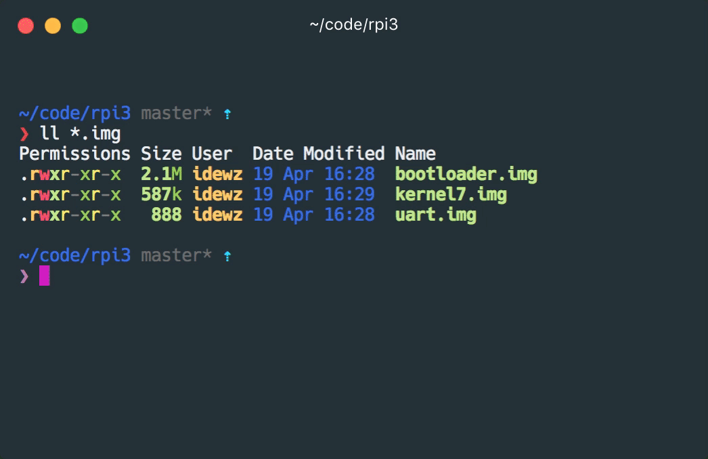

# Raspberry Pi 3 & xv6

This repository contains the XMODEM-based boot loader that allows us to send a binary image to execute on Raspberry Pi.



### What you need

#### Hardware

1. Raspberry Pi 3 Model B
2. SD Card
3. USB Power Cable
4. [USB TTL Serial Cable](https://www.amazon.com/JBtek-Raspberry-Micro-Cable-Switch/dp/B00JU24Z3W)

#### Software

1. [Driver for USB TTL Serial cable](http://www.prolific.com.tw/us/ShowProduct.aspx?pcid=41&showlevel=0041-0041)
2. Python 3
3. [GNU Arm Embedded Toolchain](https://developer.arm.com/open-source/gnu-toolchain/gnu-rm)
4. [xv6](https://github.com/idewz/xv6_rpi2_port)
5. c-kermit

### Bootloader Setup

1. Install required python packages
```bash
pip3 install pyserial xmodem
```

2. Download necessary boot files `bootcode.bin`, `start.elf`, `fixup.dat` to your SD card ([info](https://elinux.org/RPi_Software))
```bash
curl -LO https://github.com/idewz/raspbian-firmware/raw/master/\{bootcode.bin,start.elf,fixup.dat\}

cp bootcode.bin start.elf fixup.dat /Volumes/boot/
```

3. Build the bootloader and the simple uart program
```bash
make
```

4. Copy `bootloader.img` to the SD card with the name `kernel7.img`
```bash
cp bootloader.img /Volumes/boot/kernel7.img
```

5. Create `config.txt` in the SD card with these lines
```bash
kernel_old=1
disable_commandline_tags=1
enable_uart=1

```

Before we can test it, please connect your serial cable to [pin 6, 8 and 10](https://pinout.xyz/pinout/uart) of your RPi like this

|  | 
|:--:| 
| *RPi Serial Connection https://elinux.org/RPi_Serial_Connection* |

Now we can test it with our simple uart program

```bash
python3 rpi-install.py /dev/cu.usbserial uart.img && kermit
```

You should see `Hello, UART` on your screen!


### xv6

To run [xv6](https://github.com/idewz/xv6_rpi2_port), you just need to clone the repository and update the location of the TOOLCHAIN in the [Makefile](https://github.com/idewz/xv6_rpi2_port/blob/master/Makefile#L6) and run

```bash
make
python3 rpi-install.py /dev/cu.usbserial kernel7.img && kermit
```
