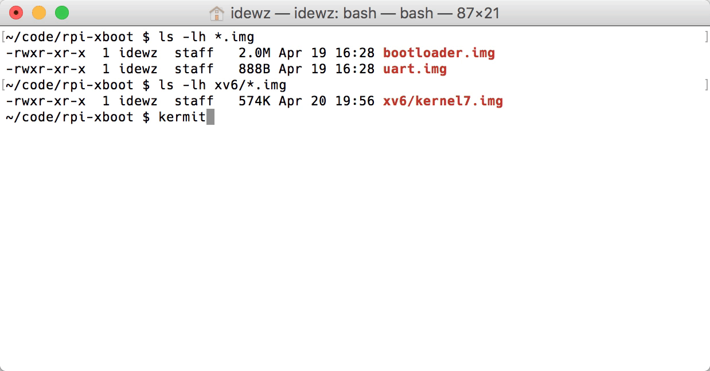

# Raspberry Pi 3 & xv6

This repository contains the XMODEM-based boot loader that allows us to send a binary image to execute on Raspberry Pi. The boot loader supports LZMA compressed kernel image to reduce transfer time (in our case, from 60s to 10s).





## What you need

### Hardware

1. Raspberry Pi 3 Model B
2. micro-SD Card
3. USB Power Cable
4. [USB TTL Serial Cable](https://www.amazon.com/JBtek-Raspberry-Micro-Cable-Switch/dp/B00JU24Z3W)

### Software

1. [Driver for USB TTL Serial cable](http://www.prolific.com.tw/us/ShowProduct.aspx?pcid=41&showlevel=0041-0041)
2. Python 3
3. [GNU Arm Embedded Toolchain](https://developer.arm.com/open-source/gnu-toolchain/gnu-rm)
4. [xv6](https://github.com/zhiyihuang/xv6_rpi2_port)
5. c-kermit


## Boot Loader Setup

1. Clone this repository.
```bash
git clone https://github.com/idewz/rpi-xboot.git
```

2. Install required python packages.
```bash
pip3 install pyserial xmodem
```

3. Copy necessary boot files `bootcode.bin`, `start.elf`, `fixup.dat` and `config.txt` to your SD card ([info](https://elinux.org/RPi_Software)).
```bash
cp firmware/*.* /Volumes/boot
```

4. Build the boot loader and the simple uart program.
```bash
make
```

5. Copy `bootloader.img` to the SD card with the name `kernel7.img`.
```bash
cp bootloader.img /Volumes/boot/kernel7.img
```

6. Connect your serial cable to [pin 6, 8 and 10](https://pinout.xyz/pinout/uart) of your RPi like [this](https://elinux.org/File:Adafruit-connection.jpg)


7. Now we can test it with our simple uart program.
```bash
python3 rpi-install.py /dev/cu.usbserial uart.img && kermit
```

Then you should see `Hello, UART` on your screen!


## xv6

To run [xv6](https://github.com/zhiyihuang/xv6_rpi2_port), please follow these steps.

1. Clone the `xv6_rpi2_port`.
```bash
git clone https://github.com/zhiyihuang/xv6_rpi2_port
cd xv6_rpi2_port
```

2. Update the location of the `TOOLCHAIN` in the [Makefile](https://github.com/zhiyihuang/xv6_rpi2_port/blob/master/Makefile#L6).

3. Decrease the memory size in [`source/main.c`](https://github.com/zhiyihuang/xv6_rpi2_port/blob/master/source/main.c#L10) to get the shorter boot time.
```c
// before
kinit2(P2V((8*1024*1024)+PHYSTART), P2V(pm_size));

// after
kinit2(P2V((8*1024*1024)+PHYSTART), P2V((40*1024*1024)+PHYSTART));
```

4. Also remove `gpuinit()` in [`source/main.c`](https://github.com/zhiyihuang/xv6_rpi2_port/blob/master/source/main.c#L91) to disable the GPU.

5. Build the xv6 kernel image.
```bash
make loader
```

5. Now you can send the kernel image to your RPi.
```bash
python3 ../rpi-xboot/rpi-install.py /dev/cu.usbserial kernel7.img && kermit
```

## Troubleshooting

### Get an SSL error during `pip3 install`

It is probably because you have an outdated version of OpenSSL. You can verify that using the following command.
```bash
python3 -c "import ssl; print(ssl.OPENSSL_VERSION)"

OpenSSL 1.0.2o  27 Mar 2018
```

If you have an older version, for example, `0.9.8zh 14 Jan 2016`, please update to a newer version of Python via homebrew or get it from the [official website](https://www.python.org/downloads/).

### Cannot see anything in kermit

Make sure you format your SD card in FAT32 (On MacOS, it is `MS-DOS (FAT)`). Then, verify the contents of the SD card. It should have
```
/Volumes/boot
├── bootcode.bin
├── config.txt
├── fixup.dat
├── kernel7.img    # a copy of bootloader.img
└── start.elf
```

### Read failed: device reports readiness to read but returned no data

You need to quit current kermit before running `rpi-install.py`. In order to do that, just press `Ctrl + \` then `q`.

### Send error: expected NAK, CRC, or CAN; got b'H'

After turn it on, you need to wait a few seconds before running `rpi-install.py` because the script expects valid characters, not "Hello" from the bootloader.


## Acknowledgements

  - [xv6](https://github.com/zhiyihuang/xv6_rpi2_port) RPi port by Zhiyi Huang and Mahdi Amiri Kordestany
  - [rpi-install.py](https://github.com/cs107e/cs107e.github.io/blob/master/cs107e/bin/rpi-install.py) by Pat Hanrahan, Julie Zelenski, Omar Rizwan from Standford [CS107e](https://github.com/cs107e)
  - [LZMA SDK](https://www.7-zip.org/sdk.html) by Igor Pavlov
  - [bootloader](https://github.com/dwelch67/raspberrypi) by David Welch
